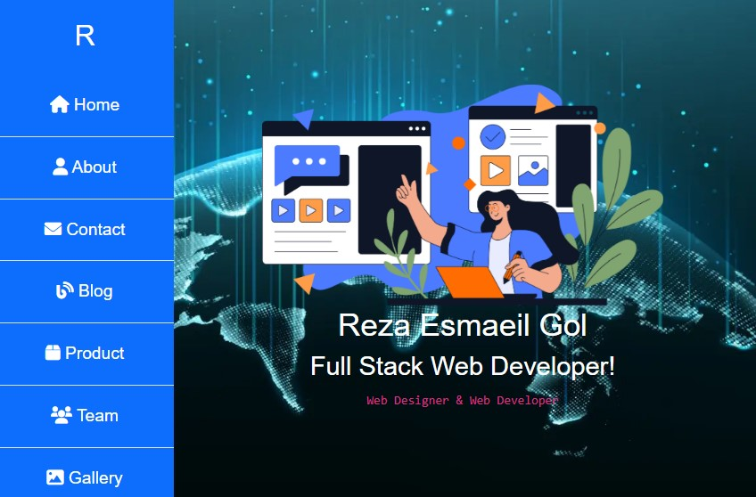

# portfolio-website-vertical-sidebar
portfolio website vertical sidebar

# My Project | پروژه من

This is a simple project that demonstrates how to insert an image in the README file and includes features of the project.  
این یک پروژه ساده است که نشان می‌دهد چگونه می‌توان یک تصویر را در فایل README قرار داد و شامل ویژگی‌های پروژه است.

## Project Image | تصویر پروژه



## Features | ویژگی‌ها

### English

- **User-Friendly Interface**: The project has an intuitive and easy-to-use interface, allowing users to quickly interact with the system.
- **Responsive Design**: The design is fully responsive and works on all devices (mobile, tablet, desktop).
- **Optimized for Performance**: The code is optimized to provide fast loading times and smooth performance.
- **Cross-Browser Compatibility**: The project supports all modern browsers, ensuring that users have a consistent experience across different platforms.
- **Secure**: Includes security measures like HTTPS, encryption, and user authentication.
- **Well-Documented**: The project has clear and comprehensive documentation for easy understanding and contribution.
- **Customizable**: The code structure is modular and allows for easy customization and extension.

### فارسی

- **رابط کاربری کاربرپسند**: پروژه دارای رابط کاربری ساده و قابل درک است که به کاربران اجازه می‌دهد به راحتی با سیستم تعامل داشته باشند.
- **طراحی واکنش‌گرا**: طراحی کاملاً واکنش‌گرا است و در همه دستگاه‌ها (موبایل، تبلت، دسکتاپ) به درستی کار می‌کند.
- **بهینه‌سازی شده برای عملکرد**: کد پروژه بهینه‌سازی شده است تا زمان بارگذاری سریع و عملکرد نرم و روانی داشته باشد.
- **سازگاری با مرورگرهای مختلف**: پروژه از تمام مرورگرهای مدرن پشتیبانی می‌کند و تجربه‌ای یکسان را در پلتفرم‌های مختلف به کاربران ارائه می‌دهد.
- **امن**: شامل تدابیر امنیتی مانند HTTPS، رمزنگاری و احراز هویت کاربران است.
- **مستندات کامل**: پروژه دارای مستندات واضح و جامع است که به فهم بهتر و مشارکت در توسعه کمک می‌کند.
- **قابلیت سفارشی‌سازی**: ساختار کد ماژولار است و امکان سفارشی‌سازی و توسعه آسان را فراهم می‌کند.

---

## Installation | نصب

### English

1. Clone the repository:
   ```bash
   git clone https://githسub.com/Rezaesmailie/portfolio-website-vertical-sidebar.git


